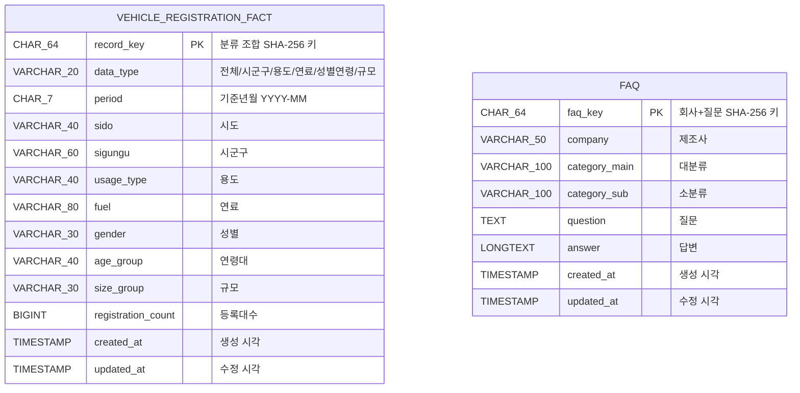

# 데이터베이스 설계문서 (ERD)

## 1. 설계 목적

이 데이터베이스는 월별 자동차 등록현황을 다양한 분석 축으로 조회하고, 제조사 FAQ를 별도로 검색하기 위한 구조입니다. 자동차 등록 통계와 FAQ는 서로 독립적인 데이터이므로 물리적인 외래 키 관계는 두지 않았습니다.

## 2. 논리 ERD



> 두 엔터티 사이에 선이 없는 것은 설계 의도입니다. `FAQ.company`는 검색용 분류이며 자동차 등록통계의 차량 제조사와 연결된 정규화 키가 아닙니다.

## 3. `vehicle_registration_fact` — 자동차 등록현황 사실 테이블

| 컬럼 | 타입 | NULL | 설명 |
|---|---|---:|---|
| `record_key` | `CHAR(64)` | N | 기준년월과 모든 분석 차원을 연결해 만든 SHA-256 고유 키, 기본 키 |
| `data_type` | `VARCHAR(20)` | N | 행의 분석 종류: 전체, 시군구, 용도, 연료, 성별연령, 규모 |
| `period` | `CHAR(7)` | N | 기준년월, `YYYY-MM` 형식 |
| `sido` | `VARCHAR(40)` | N | 시도 |
| `sigungu` | `VARCHAR(60)` | N | 시군구. 해당하지 않으면 `전체` |
| `usage_type` | `VARCHAR(40)` | N | 용도. 해당하지 않으면 `전체` |
| `fuel` | `VARCHAR(80)` | N | 연료. 해당하지 않으면 `전체` |
| `gender` | `VARCHAR(30)` | N | 성별. 해당하지 않으면 `전체` |
| `age_group` | `VARCHAR(40)` | N | 연령대. 해당하지 않으면 `전체` |
| `size_group` | `VARCHAR(30)` | N | 차종별 규모. 해당하지 않으면 `전체` |
| `registration_count` | `BIGINT` | N | 등록대수 |
| `created_at` | `TIMESTAMP` | Y | 최초 적재 시각 |
| `updated_at` | `TIMESTAMP` | Y | 마지막 갱신 시각 |

### 제약 조건과 인덱스

- 기본 키: `record_key`
- 고유 키: `(period, sido, sigungu, usage_type, fuel, gender, age_group, size_group)`
- 조회 인덱스: `ix_period(period)`, `ix_sido(sido)`, `ix_type(data_type)`

`data_type`은 화면에서 어떤 탭이 이 행을 사용해야 하는지를 구분합니다. 예를 들어 시군구 값이 `전체`가 아니면 시군구 자료, 연료가 `전체`가 아니면 연료 자료로 분류합니다.

## 4. `faq` — 제조사 FAQ 테이블

| 컬럼 | 타입 | NULL | 설명 |
|---|---|---:|---|
| `faq_key` | `CHAR(64)` | N | 회사명과 질문으로 만든 SHA-256 고유 키, 기본 키 |
| `company` | `VARCHAR(50)` | N | 현대, 기아, 쉐보레 등 제조사 |
| `category_main` | `VARCHAR(100)` | N | FAQ 대분류 |
| `category_sub` | `VARCHAR(100)` | N | FAQ 소분류 |
| `question` | `TEXT` | N | 질문 |
| `answer` | `LONGTEXT` | N | 답변 |
| `created_at` | `TIMESTAMP` | Y | 최초 적재 시각 |
| `updated_at` | `TIMESTAMP` | Y | 마지막 갱신 시각 |

### 제약 조건과 인덱스

- 기본 키: `faq_key`
- 조회 인덱스: `ix_faq_company(company)`
- 복합 인덱스: `ix_faq_category(company, category_main, category_sub)`

## 5. 적재 흐름

```text
통계누리 월별 엑셀 → car_dashboard.py → csv_from_excel.py → 자동차 등록현황 검증 CSV ─┐
                                                                                         ├─ load_mysql.py ─→ vehicle_registration_fact
FAQ CSV ─────────────────────────────────────────────────────────────────────────────────┘                    └→ faq

Streamlit
  ├─ MySQL 조회 성공 → 두 테이블 사용
  └─ MySQL 조회 실패 → data 폴더의 CSV 사용

정적 HTML → data 폴더의 CSV 사용
```

## 6. 현재 검증 상태

2026-09-25 확인 기준으로 `vehicle_registration_fact`에는 261,751행(2016-01~2026-08), `faq`에는 589행이 적재되어 있습니다. 행 수는 CSV 교체·재적재에 따라 달라질 수 있습니다.
