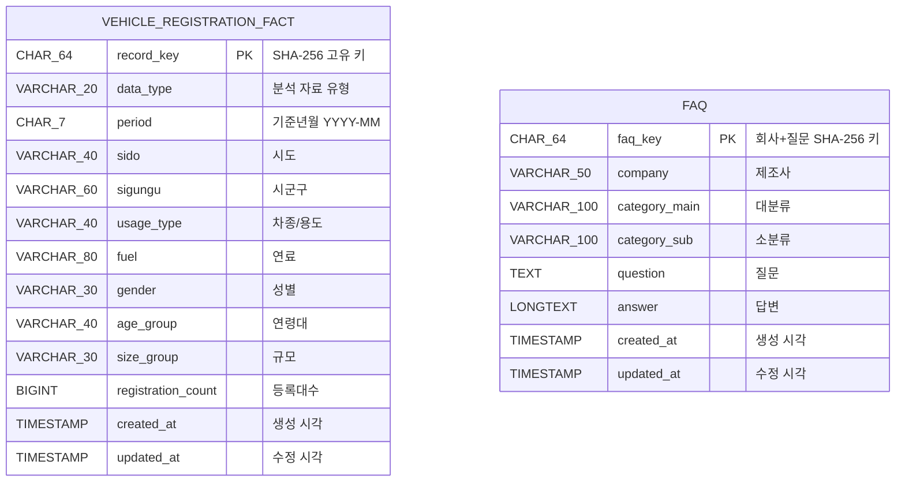
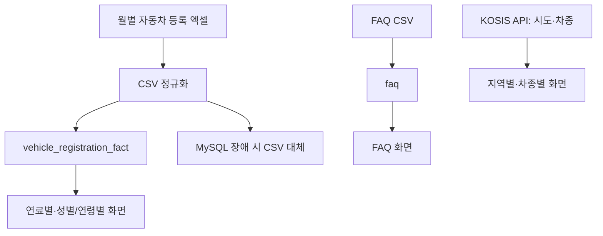

# 데이터베이스 설계서 · ERD

## 1. 설계 원칙

자동차 등록현황과 제조사 FAQ는 하나의 화면에서 조회하지만, 분석 기준과 원천이 다른 독립 데이터입니다. 따라서 테이블 사이에 물리적 외래 키를 만들지 않았습니다.

- `vehicle_registration_fact`: 월별 자동차 등록 통계를 다양한 분석 축으로 조회하는 사실 테이블
- `faq`: 제조사 고객지원 FAQ를 검색하는 문서형 테이블

## 2. 논리 ERD

> 두 엔터티 사이에 관계선이 없는 것은 의도된 설계입니다. `FAQ.company`는 FAQ 검색용 분류이며 자동차 등록 통계의 제조사 차원과 동일한 키가 아닙니다.

## 3. 테이블 명세

### `vehicle_registration_fact`

| 컬럼 | 타입 | 제약 | 설명 |
|---|---|---|---|
| `record_key` | `CHAR(64)` | PK | 기준년월과 분석 차원을 합친 SHA-256 키 |
| `data_type` | `VARCHAR(20)` | NOT NULL | 전체, 시군구, 용도, 연료, 성별연령, 규모 등 자료 유형 |
| `period` | `CHAR(7)` | NOT NULL | 기준년월 `YYYY-MM` |
| `sido` | `VARCHAR(40)` | NOT NULL | 시도 |
| `sigungu` | `VARCHAR(60)` | NOT NULL | 시군구, 해당 없으면 `전체` |
| `usage_type` | `VARCHAR(40)` | NOT NULL | 차종/용도, 해당 없으면 `전체` |
| `fuel` | `VARCHAR(80)` | NOT NULL | 연료, 해당 없으면 `전체` |
| `gender` | `VARCHAR(30)` | NOT NULL | 성별, 해당 없으면 `전체` |
| `age_group` | `VARCHAR(40)` | NOT NULL | 연령대, 해당 없으면 `전체` |
| `size_group` | `VARCHAR(30)` | NOT NULL | 규모, 해당 없으면 `전체` |
| `registration_count` | `BIGINT` | NOT NULL | 등록대수 |
| `created_at` | `TIMESTAMP` | DEFAULT | 최초 적재 시각 |
| `updated_at` | `TIMESTAMP` | DEFAULT/UPDATE | 마지막 갱신 시각 |

**인덱스**

- Primary key: `record_key`
- Unique key: `(period, sido, sigungu, usage_type, fuel, gender, age_group, size_group)`
- 조회 인덱스: `ix_period(period)`, `ix_sido(sido)`, `ix_type(data_type)`

### `faq`

| 컬럼 | 타입 | 제약 | 설명 |
|---|---|---|---|
| `faq_key` | `CHAR(64)` | PK | 제조사와 질문으로 생성한 SHA-256 키 |
| `company` | `VARCHAR(50)` | NOT NULL | 현대, 기아, 쉐보레 등 제조사 |
| `category_main` | `VARCHAR(100)` | NOT NULL | FAQ 대분류 |
| `category_sub` | `VARCHAR(100)` | NOT NULL | FAQ 소분류 |
| `question` | `TEXT` | NOT NULL | 질문 |
| `answer` | `LONGTEXT` | NOT NULL | 답변 |
| `created_at` | `TIMESTAMP` | DEFAULT | 최초 적재 시각 |
| `updated_at` | `TIMESTAMP` | DEFAULT/UPDATE | 마지막 갱신 시각 |

**인덱스**

- Primary key: `faq_key`
- 조회 인덱스: `ix_faq_company(company)`
- 복합 인덱스: `ix_faq_category(company, category_main, category_sub)`

## 4. 적재 및 조회 흐름

## 5. KOSIS 연계 기준

| 항목 | 적용 기준 |
|---|---|
| 조회 범위 | 2016~2026, 화면에서 선택한 최대 두 개 기준년월 |
| 차종 항목 | 승용·승합·화물·특수만 사용 |
| 합계 처리 | 4개 차종을 앱에서 한 번만 합산해 중복을 제거 |
| 지역 범위 | 시도 단위. 시군구 비교는 검증 CSV 기반 |
| 검증 | 2025-02·2026-02 KOSIS 전국 합계와 검증 CSV 합계 일치 |

## 6. 현재 검증 상태

- 자동차 등록현황 검증 CSV: 261,751행, 2016-01~2026-08
- FAQ CSV: 589건
- MySQL 연결 실패 시 자동차 등록현황·FAQ CSV를 대체 경로로 사용
