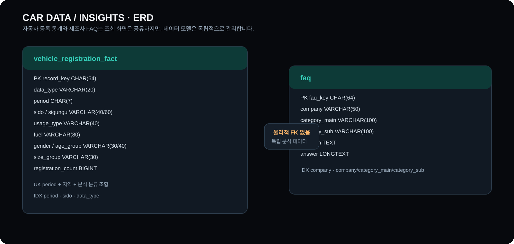
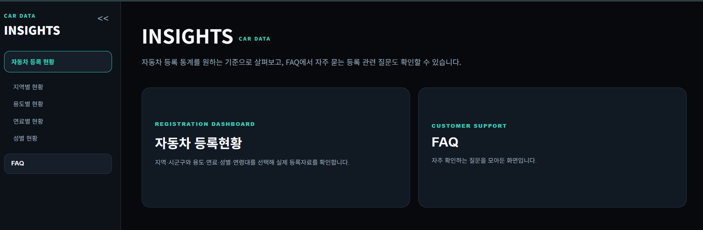
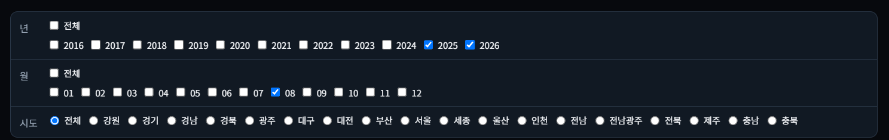
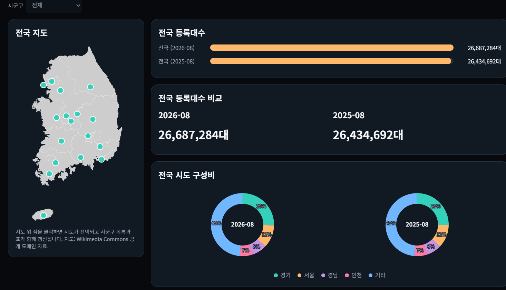
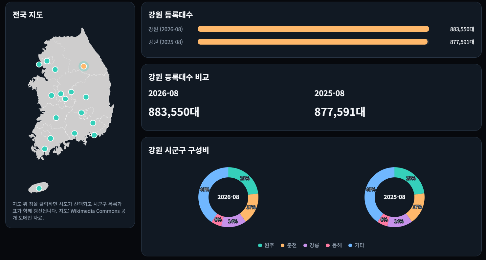
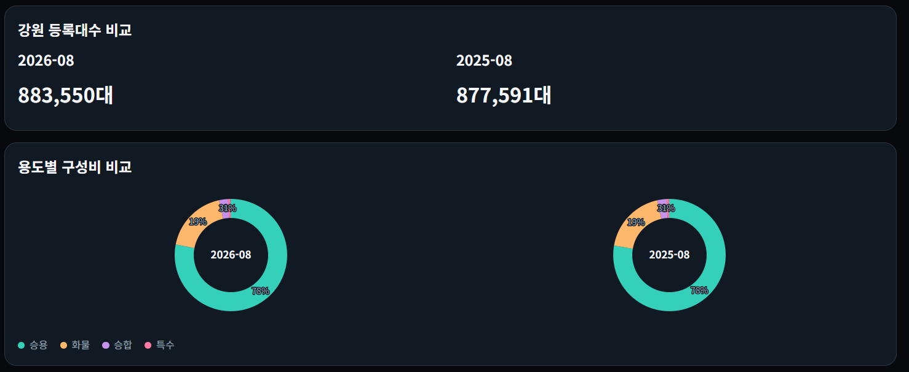
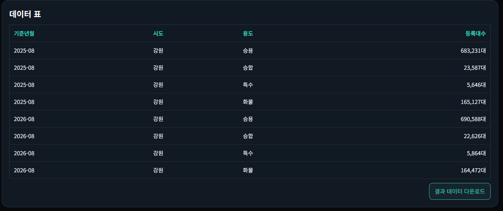
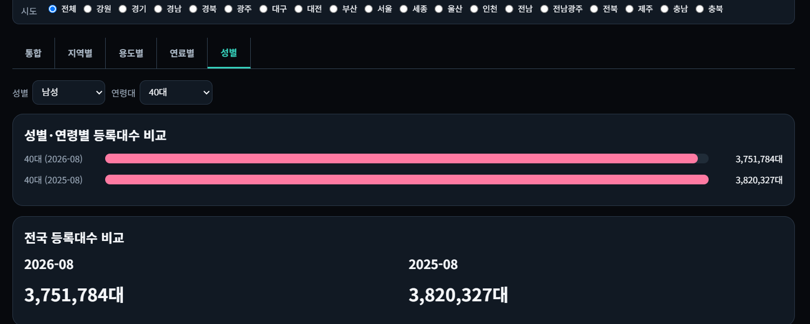
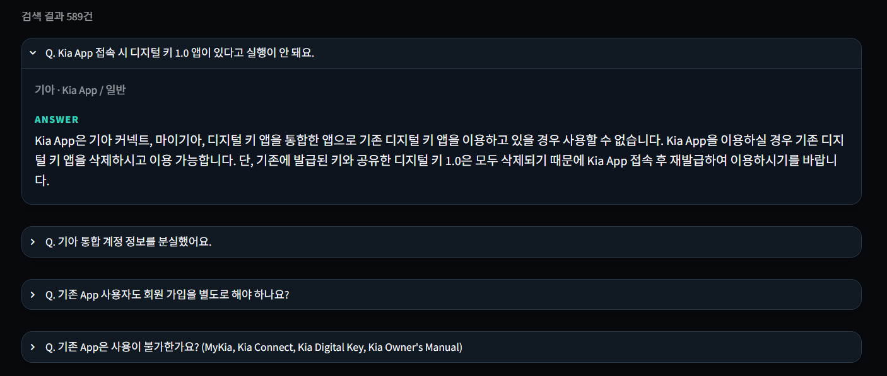
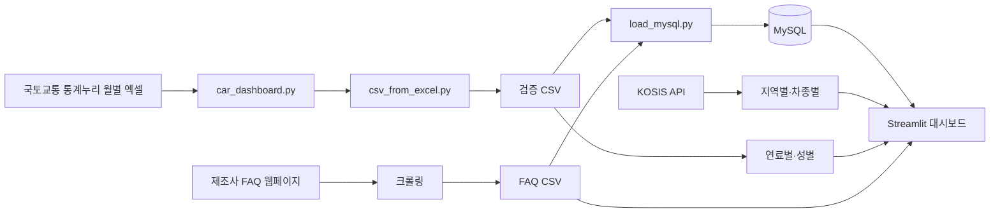

# CAR DATA / INSIGHTS

> 전국 자동차 등록 통계와 제조사 FAQ를 한 화면에서 탐색하는 데이터 대시보드



## 1. 프로젝트 소개

월별 자동차 등록 원자료는 지역·차종·연료·성별 등 여러 기준으로 나뉘어 있어 비교가 어렵습니다. 이 프로젝트는 데이터를 정규화해 **지역별·차종별·연료별·성별/연령별**로 탐색하고, 제조사 FAQ를 함께 제공하는 Streamlit 대시보드입니다.

| 항목 | 내용 |
|---|---|
| 분석 기간 | 2016-01 ~ 2026-08 |
| 자동차 등록현황 | 검증 CSV 기준 261,751행 |
| FAQ | 현대·기아·쉐보레 589건 |
| 팀원 | 김보영, 김성환, 염진일, 윤성민, 한세현 |

## 2. 프로젝트 목표

1. 분산된 월별 자동차 등록 자료를 일관된 분석 구조로 관리합니다.
2. 지역·차종·연료·성별/연령대 기준으로 등록대수를 비교합니다.
3. MySQL·KOSIS API·검증 CSV를 목적에 맞게 혼용해 조회 안정성을 확보합니다.
4. 제조사 FAQ를 같은 화면에서 탐색해 정보 접근 흐름을 단순화합니다.

## 3. 주요 기능 및 화면

### 3.1 홈 — 통계와 고객지원의 통합 진입점

자동차 등록현황과 FAQ를 한 화면에서 선택할 수 있도록 구성했습니다.



### 3.2 공통 필터 — 기간·지역 조건 선택

2016~2026년 중 최대 두 개의 연도와 월을 선택해 시점 비교를 지원합니다. 시도 선택은 모든 분석 탭에 공통 적용됩니다.



### 3.3 지역별 — 전국·시도·시군구 등록현황 비교

전국 지도에서 시도를 선택하고, 두 시점의 등록대수와 구성비를 비교합니다. KOSIS API는 시도 단위 자료를 제공하며, 시군구 구성비는 검증 CSV를 기반으로 표시합니다.





### 3.4 차종별 — 구성비와 상세 데이터 조회

승용·승합·화물·특수 차종의 두 시점 구성비를 비교하고, 필터 결과를 표와 CSV 다운로드로 제공합니다.





### 3.5 성별·연령별 — 세부 인구 통계 탐색

성별과 연령대를 선택해 등록대수 변화를 비교합니다.



### 3.6 FAQ — 제조사 질문·답변 탐색

제조사와 분류를 선택하고 질문을 펼쳐 답변을 확인할 수 있습니다.



### 추가 화면 캡처


### 3.7 시연 영상

[▶ 시연 영상 보기](https://drive.google.com/file/d/11r8oM9qk9tiUzRkKa_LZW7t5J5namZVo/view?usp=drive_link)

## 4. 데이터 아키텍처



### 화면별 데이터 원천

| 화면 | 우선 데이터 | 보조 데이터 | 비고 |
|---|---|---|---|
| 지역별·차종별 | KOSIS API | 검증 CSV | 선택한 기준년월만 API 요청, 2016~2026 |
| 연료별·성별/연령별 | MySQL 또는 검증 CSV | 검증 CSV | 파일 기반 범위와 동일 |
| FAQ | MySQL | `faq_data_total.csv` | DB 연결 실패 시 CSV 대체 |

KOSIS는 시도 단위의 지역·차종 통계를 제공합니다. 따라서 시군구 단위의 상세 비교는 검증 CSV를 기준으로 구성했습니다.

FAQ의 경우 제조사 웹페이지를 크롤링해 CSV로 정리한 뒤 MySQL에 적재하는 흐름으로 설계했습니다. 위 크롤링 단계는 수집 절차를 설명하기 위한 것이며, 이번 문서 변경으로 별도의 크롤링 코드를 추가하지는 않았습니다.

## 5. 데이터베이스 설계

상세 ERD와 컬럼 정의는 [DATABASE_DESIGN.md](DATABASE_DESIGN.md)를 참고하세요.

- `vehicle_registration_fact`: 자동차 등록현황 분석 사실 테이블
- `faq`: 제조사 FAQ 검색 테이블

FAQ의 제조사명은 검색 분류이며, 자동차 등록 통계의 분석 차원과 직접 연결되는 키가 아닙니다. 따라서 두 테이블은 물리적 외래 키로 연결하지 않고 독립적으로 관리합니다.

## 6. 프로젝트 구조

```text
project1/
├── streamlit_mysql.py          # Streamlit 대시보드
├── dashboard_mockup.html       # CSV 기반 정적 화면 목업
├── car_dashboard.py            # 월별 원본 엑셀 수집
├── csv_from_excel.py           # 엑셀 → 통합·검증 CSV 변환
├── load_mysql.py               # CSV → MySQL 적재
├── update_csv_and_mysql.py     # 변환·적재 통합 실행
├── DATABASE_DESIGN.md          # ERD 및 테이블 설계서
├── docs/
│   ├── erd.svg                 # 발표용 ERD 이미지
│   └── media/                  # 발표용 화면 캡처
└── data/
    ├── 자동차_등록현황_통합_검증.csv
    └── faq_data_total.csv
```

## 7. 실행 방법

### 환경 준비

```bash
conda create -n car-dashboard python=3.12 -y
conda activate car-dashboard
cd C:\Users\s2sad\project1
pip install -r requirements.txt
```

### 선택: `.env` 설정

```env
MYSQL_HOST=127.0.0.1
MYSQL_PORT=3306
MYSQL_USER=root
MYSQL_PASSWORD=YOUR_PASSWORD
MYSQL_DATABASE=vehicle_db
KOSIS_API_KEY=YOUR_KOSIS_API_KEY
```

- MySQL이 없어도 자동차 등록 검증 CSV와 FAQ CSV로 화면을 열 수 있습니다.
- KOSIS API 키가 없으면 지역별·차종별은 검증 CSV로 자동 대체됩니다.
- `.env`는 절대 저장소에 올리지 않습니다.

### Streamlit 대시보드 실행

```bash
streamlit run streamlit_mysql.py
```

브라우저에서 `http://127.0.0.1:8501`을 엽니다.

### 정적 HTML 목업 실행

`file:///` 직접 열기 대신 프로젝트 폴더에서 로컬 서버를 실행합니다.

```bash
python -m http.server 8000
```

그 다음 `http://127.0.0.1:8000/dashboard_mockup.html`로 접속합니다.

## 8. 데이터 적재·갱신

```bash
# 원본 엑셀 수집 → CSV 변환 → MySQL 적재
python update_csv_and_mysql.py

# 이미 만든 CSV를 MySQL에 다시 반영
python load_mysql.py --replace --replace-faq
```

테이블 구조가 바뀐 경우에만 아래 명령을 사용합니다. 기존 테이블을 재생성할 수 있습니다.

```bash
python load_mysql.py --reset --replace --replace-faq
```

## 9. 데이터 처리와 검증

- 기준년월·지역·분류 조합을 SHA-256 키로 관리하고 중복 적재를 방지했습니다.
- `10대이하`/`10대 이하`, `90대이상`/`90대 이상`처럼 표기가 다른 값은 화면에서 통일했습니다.
- KOSIS 차종 응답은 `승용·승합·화물·특수` 4개 항목만 사용해 합계 중복을 제거했습니다.
- KOSIS API와 검증 CSV의 2025-02·2026-02 전국 합계가 일치하는 것을 확인했습니다.
- MySQL 또는 API 연결에 실패해도 CSV 대체 경로로 화면이 중단되지 않도록 설계했습니다.

## 10. 회고

### 김보영

첫 번째 프로젝트를 통해 수업 시간에 배웠던 프로그램들이 실제 작업에서 어떤 식으로 활용되는지 전체적인 구조를 이해할 수 있었습니다. 주제에 맞는 오픈 API 데이터를 수집하기 위해 여러 사이트를 접근했지만 우리 주제에 100% 일치하는 데이터를 확보하기엔 어려움이 있어, 일부 데이터는 국토교통통계누리의 엑셀 데이터를 다운 받아 변환 작업을 진행했습니다. 팀원들의 도움을 받아 자동차 기업의 데이터를 Crawling을 통해 수집하고 MySQL에서 Table로 변환하여 DB를 저장하는 방법을 익혔고, 생성형 AI를 활용하여 화면을 구현하는 Streamlit 코드를 생성하고 적용해봤습니다. 전체적인 작업을 완전히 독립적으로 매끄럽게 수행하지는 못했지만 지금까지 배운 내용들이 어떤 방식으로 연결되어 구현되는지 이해할 수 있는 의미있는 시간이었습니다. 특히 A~Z까지 모두 구현한 팀장님 및 팀원들 개개인의 산출물을 보며 더 많은 것을 배울 수 있었습니다. 좋은 분들과 함께 작업할 수 있어서 짧지만 좋은 시간이었습니다. 모두 감사합니다.

### 김성환

단위 프로젝트를 준비하면서 생성형 AI 활용을 하다보니 강사님이 말씀하신 자괴감에 빠져 허우적대긴 했지만, 계속적으로 상세히 물어보고 진행함에 따라 조금씩 이해도를 높일 수 있었습니다. 다만, Python 및 MySQL에 대한 공부가 더 필요하겠다는걸 절실히 느꼈습니다. AI 활용을 하더라도 전체적인 이해도가 있어야 수정 및 보완하기 편하고 제가 의도한 대로 설계 및 구현할 수 있다는걸 느꼈기 때문입니다.

### 한세현

프로그래밍 언어로는 팀 프로젝트가 처음이라 시작 전에는 굉장히 걱정이 됐었습니다. 프로젝트를 구상할 때는 아이디어가 잘 안 떠올라서 막막했던 점도 있었는데 팀원분들과 의견을 나누면서 토의를 진행하고 나니 틀이 잡혔고 그 후로는 오히려 속도를 내서 진행 할 수 있었습니다. 다만 크롤링 작업중에 애로사항이 많이 발생해서 그 부분에서 시간이 좀 걸렸습니다. 현대 자동차 FAQ 웹페이지 크롤링이 정말 많은 문제가 있었는데 한 페이지를 수집한 뒤 다음 페이지를 넘어가는 코드가 계속해서 잘못 적용되는 상황이 반복되어 그 부분을 수십 번 정도 고쳤던 기억이 납니다. 확실히 여러 의견들을 종합하여 진행하니 혼자 하는 것보다는 더 좋은 결과물이 나왔다고 생각합니다. 다들 수업 내용의 이해도가 높다고 생각했고 저도 더 열심히 학습에 참여해야겠다고 느꼈던 프로젝트인 것 같습니다.

### 염진일

짧은 일정에 주어진 기능을 구현하는데 어려움이 있었고 그걸 변명 삼아 설계를 제대로 하지 못 한 점은 아쉬움이 남습니다. AI를 활용하여 기능을 보여 줄 수 있을 정도로 마무리를 하긴 했지만 파이썬과 데이터베이스를 활용하는 부분이 부족했고 특히나 웹 크롤링 부분은 이해를 못 한 채로 마무리했기 때문에 이 부분은 추후에 별도로 구현을 해봐야 할 것 같습니다. 짧은 시간이었지만 색다른 경험을 하게되어서 이 경험들이 앞으로 많은 도움이 될 것 같고 긴 시간동안 제 결과물을 기다려주신 팀장 및 팀원분들께 감사드립니다.

### 윤성민

첫 프로젝트라 경험이 부족해 걱정이 앞섰지만, 수업 시간에 배운 내용을 하나씩 적용하고 팀원들과 협력하며 프로젝트를 진행했습니다. 혼자가 아닌 팀원들과 함께 데이터 수집과 크롤링 등 다양한 작업을 직접 경험하면서 많은 것을 배울 수 있었고, 서로 역할을 나누고 부족한 부분을 보완한 덕분에 프로젝트를 무사히 마무리할 수 있었습니다.
돌이켜보면 제가 팀에 충분한 도움이 되었는지 아쉬움도 남지만, 이번 프로젝트를 통해 협업의 중요성과 함께 부족한 부분을 배워갈 수 있었던 좋은 경험이었습니다. 함께 끝까지 프로젝트를 진행한 5조 팀원분들 모두 정말 고생 많으셨습니다.
